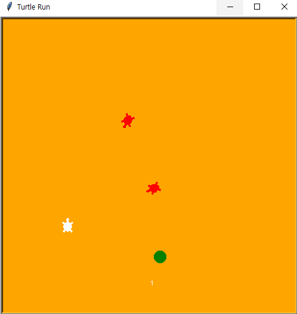
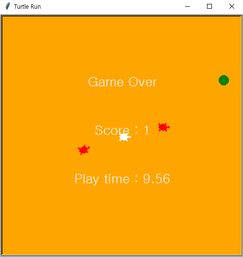

## Turtle RUN 2 Improvement

- 하얀 거북이를 조종해 초록색 먹이를 최대한 많이 먹어 score를 올림
- 붉은 거북이와 만나면 게임 종료
- 점수 계산, 난이도 변화, 제목표시, 시작/종료 등 기능 추가
- 플레이 시간 추가
- 일정 시간 지나면 붉은 거북이 한마라 추가

```python
import random
import turtle as t
import time

te = t.Turtle()  #enemy
te.shape('turtle')
te.color('red')
te.up()
te.goto(0,200)
te_start = te.pos()

te2 = t.Turtle()  #enemy2
te2.shape('turtle')
te2.color('red')
te2.up()
te2.goto(0,200)
te2_start = te2.pos()
te2.hideturtle()


ts = t.Turtle()  # food
ts.shape('circle')
ts.color('green')
ts.up()
ts.goto(0, -200)
ts_start = ts.pos()

score = 0
playing = False

start_time = 0
end_time = 0

def turn_up():
    t.setheading(90)


def turn_down():
    t.setheading(270)

    
def turn_left():
    t.setheading(180)

    
def turn_right():
    t.setheading(0)


def start():

    global playing
    global start_time
    global end_time

    if not playing:
        playing = True
        t.clear()
        #t.goto(t_start)
        te.goto(te_start)
        ts.goto(ts_start)
        start_time = time.time()
        play()
        

def play():
    global score
    global playing

    t.forward(20)

    if random.randint(1,5) == 3:
        ang = te.towards(t.pos())
        te.setheading(ang)
        
    speed = score + 5

    if speed > 20:
        speed = 20
    te.forward(speed)

    if time.time() - start_time > 5.00:
        te2.showturtle()
        ang2 = te2.towards(t.pos())
        te2.setheading(ang2)
        te2.forward(14)
        
    if t.distance(ts) < 15:   # ts.xcor(), tx.ycor() 나눌 필요 없음
        score += 1
        t.write(score)
        ts.goto(random.randint(-230,230), random.randint(-230,230))

    if t.distance(te) < 12 or t.distance(te2) < 12:   #악당과의 거리가 10보다 작으면 
        text = 'Score : ' + str(score)
        #message('Game Over',text)
        playing = False
        score = 0
        end_time = time.time()
        total_time = end_time - start_time
        total_time = format(total_time, ".2f")
        text2 = 'Play time : ' + str(total_time)
        message('Game Over', text, text2)

    if playing:
        t.ontimer(play, 50)


def message(*args):
    t.clear()
    y_coor = 100
    for arg in args:
        print(arg)
        t.goto(0, y_coor)
        t.write(arg, False, 'center', ('', 20))
        y_coor -= 100
    t.home()


# 메소드 오버로딩 안됨
#args -- 이름이 없는 인자를 저장하는 tuple
#kwargs -- 이름이 있는 인자를 저장하는 dict

#ground
t.title('Turtle Run')
t.setup(500,500)
t.bgcolor('orange')
t.up()


#초기 main tutle 위치 셋팅
t.goto(0,0)
t_start = t.pos()
t.shape('turtle')
t.color('white')
t.speed(0)
t.onkeypress(turn_up, 'Up')
t.onkeypress(turn_down, 'Down')
t.onkeypress(turn_left, 'Left')
t.onkeypress(turn_right, 'Right')  # 이벤트핸들러 검색해보기
t.onkeypress(start, 'space')
t.listen()
message('Turtle Run', '[Space]')
```

#### 게임 화면
test

test2


